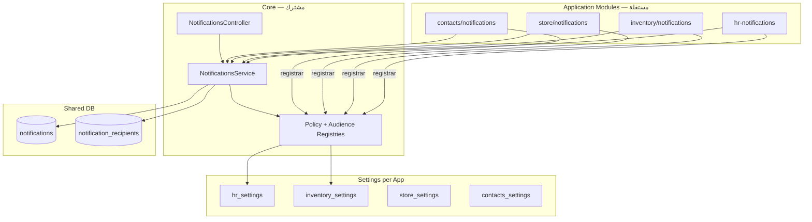

# نظام الإشعارات — دليل البنية والفرونت (ERP)

دليل لفريق الواجهة: البنية الحالية بعد فصل **Core** عن **HR** و**Inventory**، مع إمكانية تسليم كل تطبيق بشكل مستقل.

---

## 1) ملخص سريع

| السؤال | الجواب |
|---|---|
| هل الإشعارات عامة على ERP؟ | **الجداول مشتركة** (`notifications`, `notification_recipients`) |
| أين الـ API المشترك؟ | **`CoreNotificationsModule`** — inbox، إرسال، admin |
| HR | inbox بالـ **`employeeId`** + خطابات PDF + acknowledge payslip |
| Inventory | inbox بالـ **`userId`** + `inventory_settings` |
| Store | inbox بالـ **`userId`** + `store_settings` |
| Contacts | inbox بالـ **`userId`** + `contacts_settings` |
| استقلال التطبيقات | **لا import** بين HR / Inventory / Store / Contacts |

---

## 2) البنية (Modules)



### مجلدات الكود

| Module | Path | Role |
|---|---|---|
| **Core** | `src/modules/core-notifications/` | entities, service, controller, registries |
| **HR** | `src/modules/hr-notifications/` | dispatch, policy, audience (employees), letter PDF |
| **Inventory** | `src/modules/inventory/notifications/` | dispatch, policy, audience (users) |
| **Store** | `src/modules/store/notifications/` | dispatch, policy, audience (users) |
| **Contacts** | `src/modules/contacts/notifications/` | dispatch, policy, audience (users) |

---

## 3) الجداول المشتركة

### `notifications`

حدث واحد لكل حدث عمل (لا يُكرَّر لكل مستلم).

| Field | Description |
|---|---|
| `companyId` | الشركة |
| `category` | `leave`, `payroll`, `discipline`, **`inventory`**, … |
| `severity` | `info`, `success`, `warning`, `error` |
| `titleAr` / `bodyAr` | النص المعروض |
| `audienceKind` | `employee`, `branch`, `department`, `company` |
| `sourceKind` | مفتاح الحدث — `violation_record_created`, `inventory_low_stock`, … |
| `sourceTable` / `sourceId` | رابط بالسجل المصدر |
| `requiresAcknowledgment` | HR compliance (payslip, letters) — عادة `false` للمخازن |

**Entity:** `src/modules/core-notifications/entities/notification.entity.ts`

### `notification_recipients`

| Field | HR | Inventory |
|---|---|---|
| `employeeId` | ✅ المستلم | `null` |
| `userId` | اختياري | ✅ المستلم |
| `readAt`, `dismissedAt`, … | حالة inbox | نفس الحقول |

**Migration:** `1783373644674-notification-recipients-user-id.ts` — `employee_id` و `user_id` nullable مع unique indexes منفصلة.

---

## 4) Policy & Audience (Registry Pattern)

عند `NotificationsService.notify()`:

1. **Policy resolver** — هل مسموح؟ (حسب `sourceKind` → toggle في `hr_settings` أو `inventory_settings`)
2. **Audience resolver** — من المستلمون؟
3. إدراج `notifications` + `notification_recipients`

| App | Policy | Audience |
|---|---|---|
| HR | `HrNotificationPolicyResolver` | موظفون (`employeeId`) |
| Inventory | `InventoryNotificationPolicyResolver` | مستخدمون (`userId`) — **scoped:** `inv.notifications.read` + نطاق فرع (انظر [inventory doc](./inventory-notifications-frontend.md#6-الجمهور-audience--من-يستلم-فعليا)) |
| Store | `StoreNotificationPolicyResolver` | مستخدمون (`userId`) — **scoped:** `sta.notifications.read` company-wide (انظر [store doc](./store-notifications-frontend.md#6-الجمهور-audience--من-يستلم-فعليا)) |

إذا `notificationsEnabled = false` → `return null` (صامتًا).

---

## 5) API Core — Inbox

**Base:** `/notifications`  
**Swagger tag:** `Core - Notifications`  
**Controller:** `src/modules/core-notifications/notifications.controller.ts`

### HR — inbox الموظف

| Method | Path | Permission |
|---|---|---|
| GET | `/notifications/inbox/:employeeId` | `hr.notifications.read` **أو** `inv.notifications.read` |
| GET | `/notifications/inbox/:employeeId/unread-count` | `hr.notifications.read` **أو** `inv.notifications.read` |
| POST | `/notifications/inbox/:employeeId/mark-all-read` | `hr.notifications.update` **أو** `inv.notifications.update` |
| POST | `/notifications/inbox/:employeeId/recipients/:recipientId/read` | `hr.notifications.update` **أو** `inv.notifications.update` |
| POST | `/notifications/inbox/:employeeId/recipients/:recipientId/unread` | `hr.notifications.update` **أو** `inv.notifications.update` |
| POST | `/notifications/inbox/:employeeId/recipients/:recipientId/dismiss` | `hr.notifications.update` **أو** `inv.notifications.update` |
| POST | `/notifications/inbox/:employeeId/recipients/:recipientId/archive` | `hr.notifications.update` **أو** `inv.notifications.update` |
| POST | `/notifications/inbox/:employeeId/recipients/:recipientId/acknowledge` | **`hr.notifications.update` فقط** |

**Query:** `companyId`, `category`, `unreadOnly`, `includeDismissed`, `includeArchived`, `includeExpired`, `page`, `limit`

**Admin (HR):**

| Method | Path | Permission |
|---|---|---|
| GET | `/notifications` | `hr.notifications.read` |
| GET | `/notifications/:id` | `hr.notifications.read` |
| GET | `/notifications/:id/recipients` | `hr.notifications.read` |
| GET | `/notifications/by-user/:userId` | `hr.notifications.read` — inbox عبر ربط user→employee |
| POST | `/notifications` | `hr.notifications.create` |
| DELETE | `/notifications/:id` | `hr.notifications.delete` |

### Inventory — inbox المستخدم

| Method | Path | Permission |
|---|---|---|
| GET | `/notifications/inbox/user/:userId` | `inv.notifications.read` (أو HR read) |
| GET | `/notifications/inbox/user/:userId/unread-count` | `inv.notifications.read` (أو HR read) |
| POST | `/notifications/inbox/user/:userId/mark-all-read` | `inv.notifications.update` |
| POST | `/notifications/inbox/user/:userId/recipients/:recipientId/read` | `inv.notifications.update` |

**فلترة مخازن:** `?category=inventory&companyId=...`

> **جمهور المخازن (v2):** ليس broadcast — المستلم = `inv.notifications.read` + نطاق الفرع. المنفّذ **لا** يُستبعد. التفاصيل: [`inventory-notifications-frontend.md` §6](./inventory-notifications-frontend.md#6-الجمهور-audience--من-يستلم-فعليا).

> التفاصيل الكاملة للمخازن: [`docs/inventory-notifications-frontend.md`](./inventory-notifications-frontend.md)

---

## 6) API HR — خطابات PDF (منفصل عن Core inbox)

**Swagger tag:** `HR - Notification Letters`  
**Controller:** `src/modules/hr-notifications/hr-notifications.controller.ts`

| Method | Path | Permission |
|---|---|---|
| GET | `/notifications/:id/pdf?employeeId=` | `hr.notifications.read` |
| POST | `/notifications/:id/employee-sign-file` | `hr.notifications.read` أو `update` |

---

## 7) إعدادات HR

| Method | Endpoint | Permission |
|---|---|---|
| GET | `/hr/settings/company/:companyId` | `hr.notifications.read` |
| PATCH | `/hr/settings/company/:companyId` | `hr.notifications.update` |

**Master:** `notificationsEnabled` — يوقف كل إشعارات HR.

**مثال toggle:** `notifyDisciplineViolationCreated` ↔ `sourceKind: violation_record_created`

**Policy:** `src/modules/hr-settings/hr-settings-notification.policy.ts`

---

## 8) إعدادات Inventory (مفعّلة)

| Method | Endpoint | Permission |
|---|---|---|
| GET | `/inventory/settings/company/:companyId` | `inv.settings.read` |
| PATCH | `/inventory/settings/company/:companyId` | `inv.settings.update` |

**Master:** `notificationsEnabled`  
**Toggles:** `notifyLowStock`, `notifyReceiptCompleted`, … — راجع دليل المخازن.

**Policy:** `src/modules/inventory/settings/inventory-settings-notification.policy.ts`

---

## 9) Categories & sourceKind

```typescript
enum NotificationCategory {
  Leave = 'leave',
  Discipline = 'discipline',
  Payroll = 'payroll',
  Contract = 'contract',
  Attendance = 'attendance',
  Advance = 'advance',
  Announcement = 'announcement',
  System = 'system',
  Inventory = 'inventory',  // ← مخازن
}
```

**Prefix routing:**

- `inventory_*` → `inventory_settings` + audience **users**
- HR kinds → `hr_settings` + audience **employees**

---

## 10) Checklist الفرونت

### HR

- [ ] إعدادات HR → `/hr/settings/company/:companyId`
- [ ] Inbox → `/notifications/inbox/:employeeId` (employeeId من ملف الموظف)
- [ ] Acknowledge payslip → `POST .../acknowledge`
- [ ] PDF خطاب → `GET /notifications/:id/pdf`
- [ ] فلتر `category` (leave, payroll, discipline, …)

### Inventory

- [ ] إعدادات → `/inventory/settings/company/:companyId`
- [ ] Inbox → `/notifications/inbox/user/:userId?category=inventory`
- [ ] Badge → `unread-count` + `byCategory.inventory`
- [ ] Deep link → `sourceTable` + `sourceId`
- [ ] **لا** تستخدم employee inbox لتطبيق مخازن فقط

### ERP Shell — الجرس الموحّد (✅ مُنفَّذ)

| البند | التفاصيل |
|---|---|
| المكوّن | `UnifiedNotificationBellPopover` — `src/features/notifications/components/` |
| الدمج | `src/components/layouts/topbar.tsx` |
| قراءة الكل | scoped للتبويب النشط |
| Legacy | `*NotificationBellPopover` القديمة باقية — غير مستخدمة في topbar |

- [x] Bell واحد — tabs حسب التطبيقات المثبتة + الصلاحيات
- [x] HR tab: `employeeId` | Inventory/Store/Contacts: `userId`
- [x] إخفاء تبويبات بدون صلاحية أو موديول غير مفعّل

---

## 11) استقلال التطبيقات

| ❌ لا | ✅ بدلًا |
|---|---|
| toggles مخازن في `hr_settings` | `inventory_settings` |
| Inventory يستورد `HrNotificationsModule` | `CoreNotificationsModule` فقط |
| inbox مخازن بـ `employeeId` | inbox بـ `userId` |
| جداول منفصلة لكل app | Core tables + `category` / resolver |

---

## 12) ملفات مرجعية

| Topic | Path |
|---|---|
| Core service | `src/modules/core-notifications/notifications.service.ts` |
| Core controller | `src/modules/core-notifications/notifications.controller.ts` |
| Policy registry | `src/modules/core-notifications/policy/` |
| Audience registry | `src/modules/core-notifications/audience/` |
| HR dispatch | `src/modules/hr-notifications/hr-notification-dispatch.service.ts` |
| Inventory dispatch | `src/modules/inventory/notifications/inventory-notification-dispatch.service.ts` |
| Category enum | `src/modules/core-notifications/enums/notification-category.enum.ts` |
| Installed products | `src/core/system-init/apps/installed-products.ts` |

---

## 13) القنوات

| Channel | الحالة |
|---|---|
| `in_app` | ✅ Inbox |
| `email` | ⚠️ مسار منفصل — `EmailModule` + `email_event_settings` |
| `sms` / `push` | Enum فقط — لا تنفيذ |

---

## 14) المتجر (Store) — مفعّل

| Method | Endpoint | Permission |
|---|---|---|
| GET | `/store/settings/company/:companyId` | `sta.settings.read` |
| PATCH | `/store/settings/company/:companyId` | `sta.settings.update` |

Inbox: `category=store` — راجع [`docs/store-notifications-frontend.md`](./store-notifications-frontend.md)

---

## 15) جهات الاتصال (Contacts) — مفعّل

| Method | Endpoint | Permission |
|---|---|---|
| GET | `/contacts/settings/company/:companyId` | `cnt.settings.read` |
| PATCH | `/contacts/settings/company/:companyId` | `cnt.settings.update` |

Inbox: `category=contacts` — راجع [`docs/contacts-notifications-frontend.md`](./contacts-notifications-frontend.md)

---

*آخر تحديث: أغسطس 2026 — Core + HR + Inventory + Store + Contacts notifications مفعّلة ومستقلة.*
